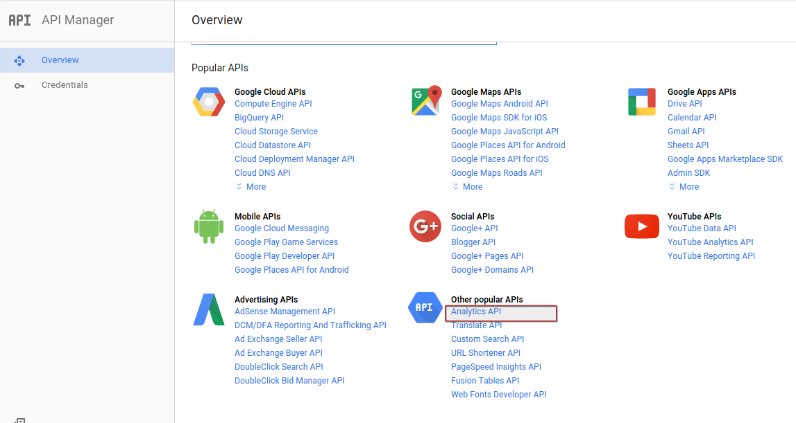
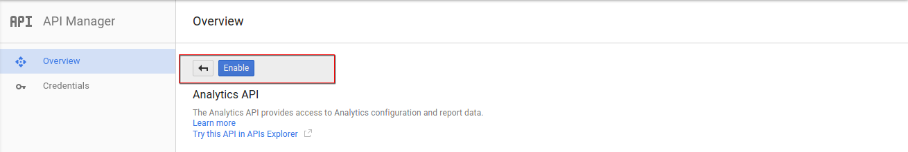
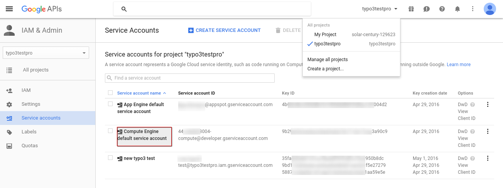
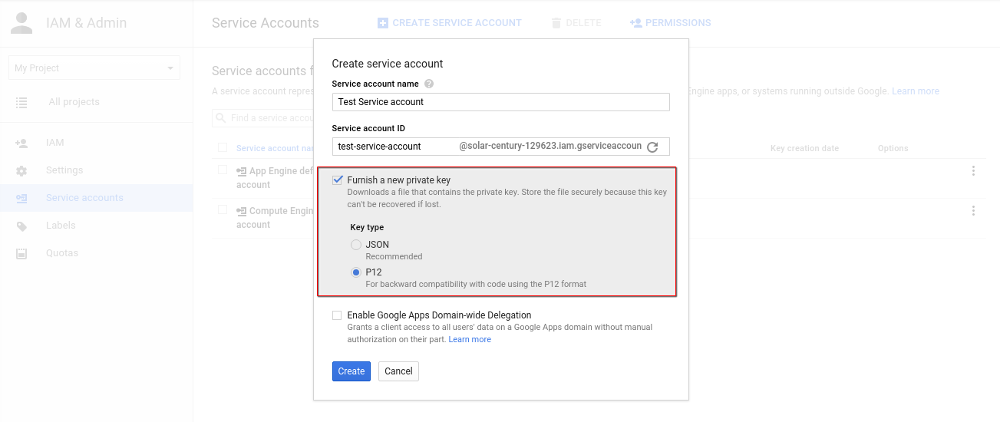
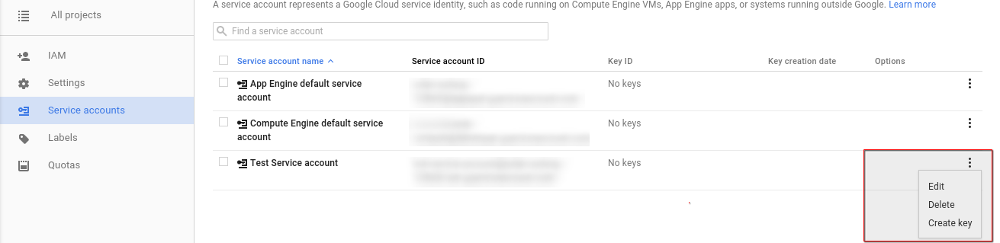
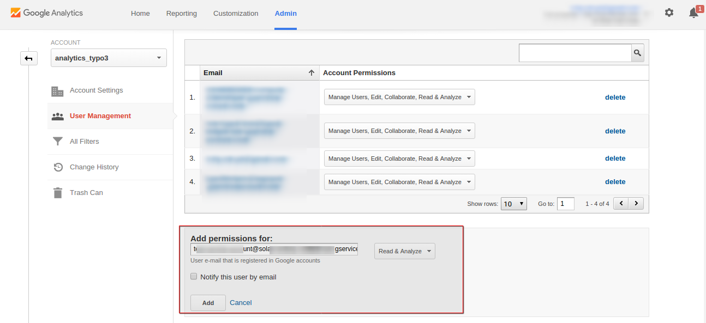

.. ==================================================
.. FOR YOUR INFORMATION
.. --------------------------------------------------
.. -*- coding: utf-8 -*- with BOM.

.. include:: ../Includes.txt

.. _faq:

FAQ
===

.. _caniuseoldmails:

How to get service account email and key file?
---------------------------------------------

Service account email and key files are two credentials provided by Google for authenticating a user before retrieving the analytic data associated with an anaytic account. so we need to furnish these details for creating an account in Site Statistics module.

Before you go to get your credentials you have to enable the analytics api in your Google Developer Console https://console.developers.google.com/ .See the screen shots.

Enabling the Analytics Api.

After you have enabled the Analytics Api you need to create a project.Under that project you can create service accounts.There will be two accounts already there once you created a project.Among that two accounts you can use the 'service account id' of the account named 'Compute Engine default service account' for furnishing the Service Account Email or you can create your own custom service account and you can use that 'service account id'.

The Key file we require is a p12 file which can be generated on creating a new sevice account or after created a service account.see the screen shots.

Getting key file while creating a service account.

Creating key file after the service account has been created.

For more information on this regard you can see the Google official documentation here::     https://developers.google.com/analytics/devguides/reporting/core/v3/quickstart/service-php

.. _caniuseoldforms:

How to set the tracking ID ?
------------------------------------
For setting Analytics tracking id we have better Google documentation here :: https://support.google.com/analytics/answer/1008080?hl=en

Once you got the tracking ID , you have to add the 'service account id' under that tracking property.There wil be a section called 'user management' in Analytics admin Dashboard.You just add your 'service account id' there.See the screen shot.

