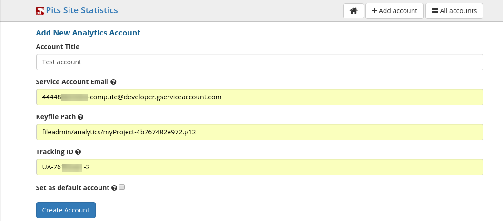
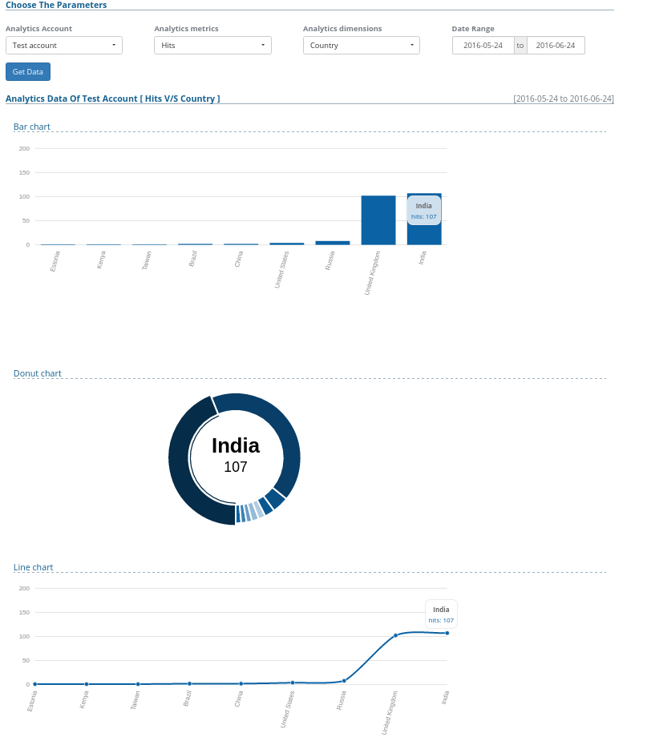

.. ==================================================
.. FOR YOUR INFORMATION
.. --------------------------------------------------
.. -*- coding: utf-8 -*- with BOM.

.. include:: ../Includes.txt

.. _users-manual:

Users manual
============

Installation
------------
* You can install the extension using extension manager.
* Once installed it will appear under 'system' section.

Requirements
------------
* cURL Library.
* Typo3 7.6.0 and Above.

Configuration of analytic accounts
----------------------------------
* Once you installed you have to configure your analytic account (the one that you created for your site).
* For adding an analytic account you have to provide four mandatory fields

(1) Account Title
(2) Service Account Email
(3) Key File Path
(4) Tracking ID

	Account creation form

* You can add any number of analytic account (helpful for multiple domain sites).

Querying data in a configured account
-------------------------------------

Once an account is configured right you can query for data by choosing the metric,dimension and date range parameters for that particular account.

See the plotted analytics data got while we queried 'Hits' against 'Country'.

	'Hits' against 'Country' data
