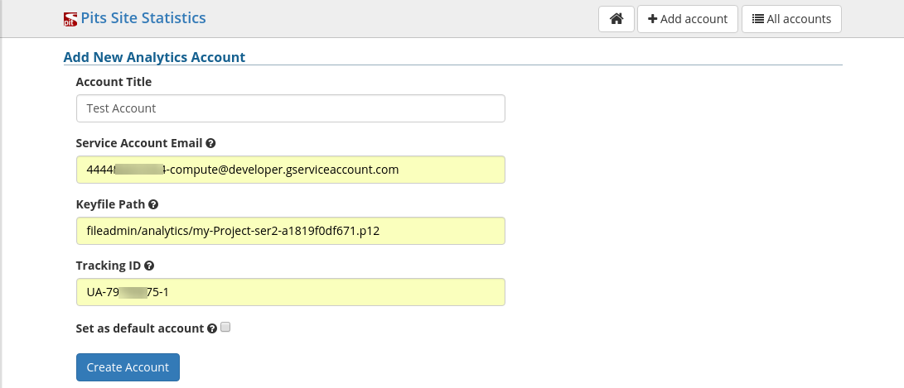

.. ==================================================
.. FOR YOUR INFORMATION
.. --------------------------------------------------
.. -*- coding: utf-8 -*- with BOM.

.. include:: ../Includes.txt

.. _users-manual:

Users manual
============

Documentation of how to use the extension, how it works, how to apply it, if it's a website plugin.

Installation
------------
* You can install the extension using extension manager.
* Once installed it will appear under 'system' section.

Configuration of analytic accounts
----------------------------------
* Once you installed you have to configure your analytic account (the one that you created for your site).
* For adding an analytic account you have to provide four mandatory fields

1 Account Title
2 Service Account Email
3 Key File Path
4 Tracking ID

Target group: **Users**

	Account creation form

* You can add any number of analytic account (helpful for multiple domain sites).

Link to official documentation
------------------------------

Sphinx makes it easy to link to official TYPO3 documentation:

- :ref:`TYPO3 Tutorial for Editors <t3editors:start>`
- :ref:`Getting Started Tutorial <t3start:start>`

and you may even link to a very specific chapter explaining how to :ref:`create a browser condition <t3tsref:condition-browser>` within the TypoScript Reference.

For a complete reference of available cross-link prefixes, please consult file ``_make/conf.py``.

FAQ
^^^

Possible subsection: FAQ
